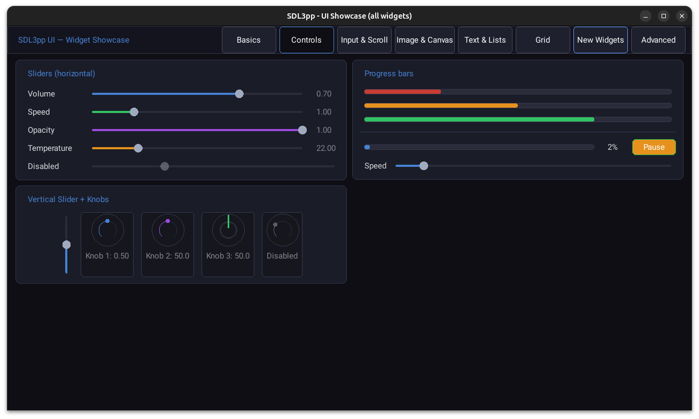
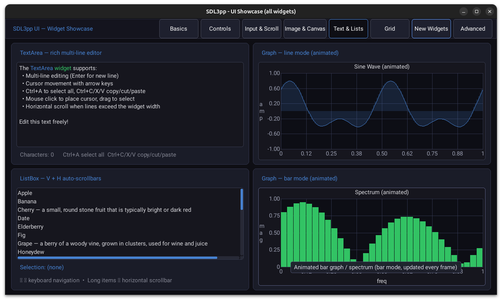
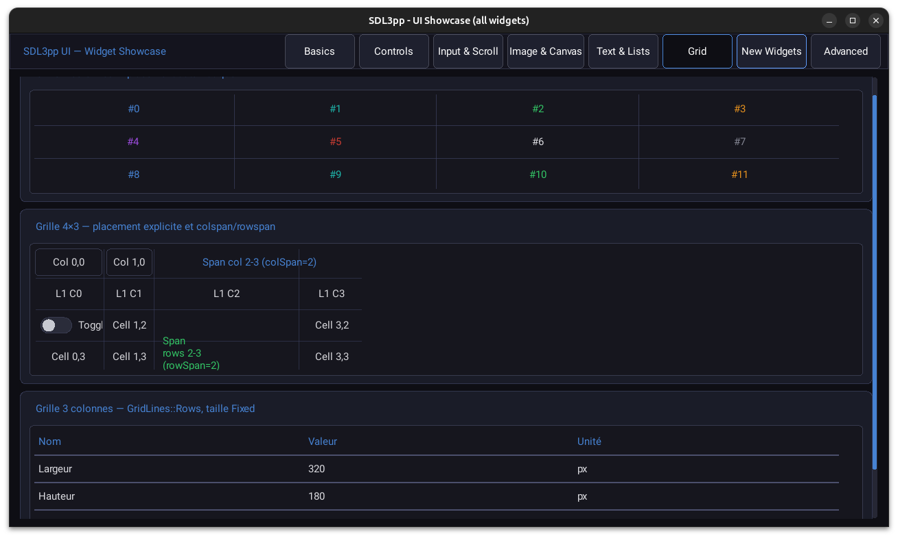
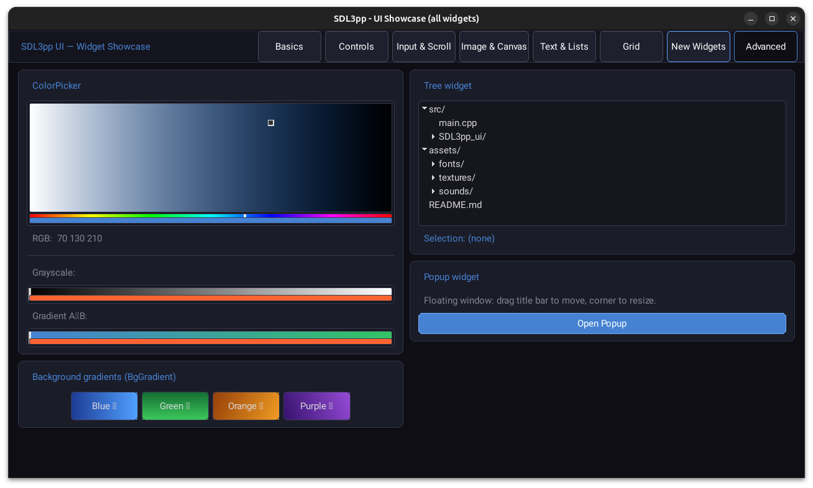
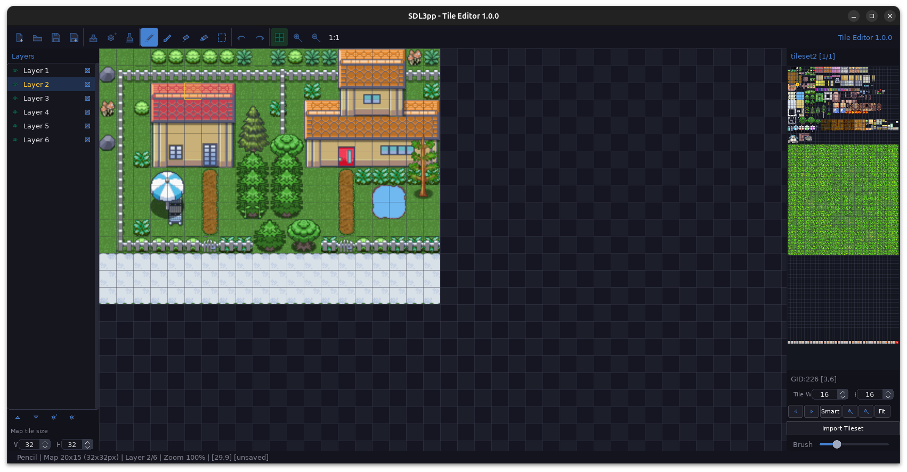
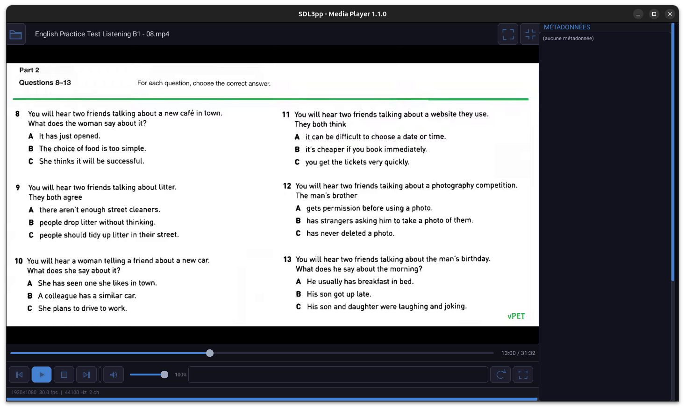
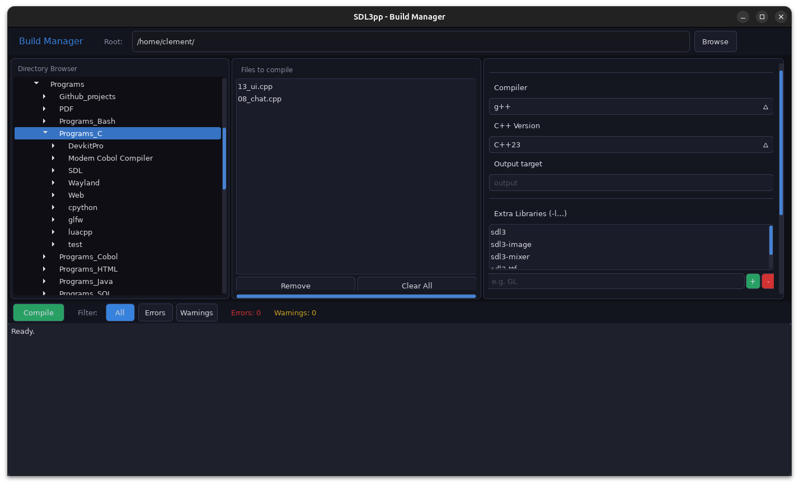
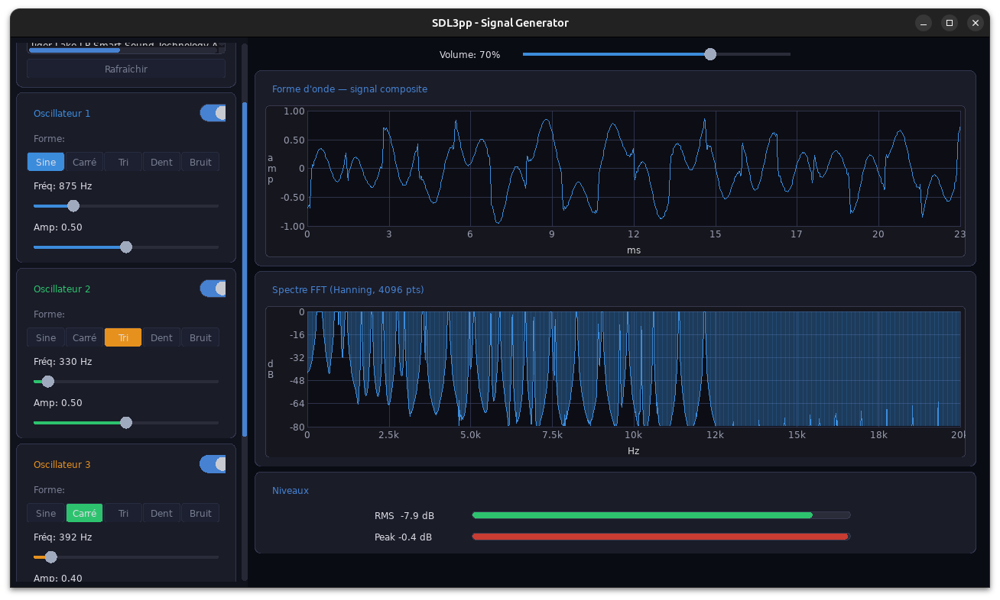
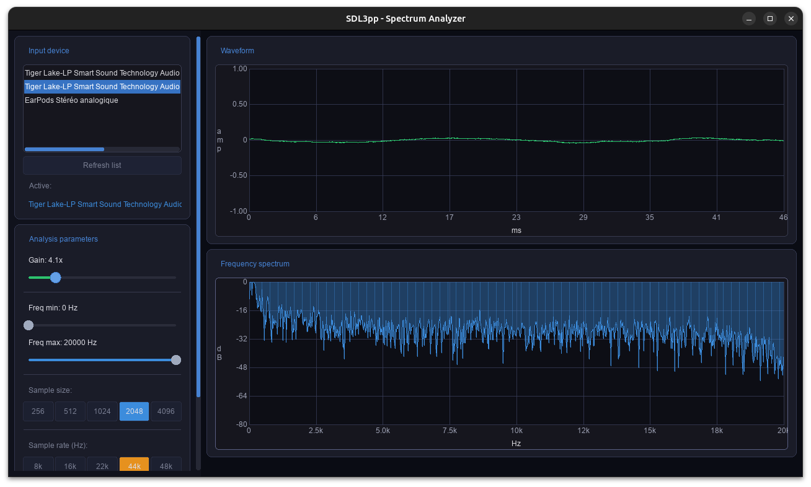

# SDL3pp

> **C++23 RAII wrappers for SDL3, SDL3\_image, SDL3\_mixer, SDL3\_ttf and SDL3\_net**

---

[English](#english) | [Français](#français)

---

## English

### Overview

**SDL3pp** is a modern C++23 header-only wrapper library that brings idiomatic C++ to the SDL3 ecosystem. It wraps the SDL3 C API — as well as the SDL3\_image, SDL3\_mixer and SDL3\_ttf satellite libraries — into safe, expressive, zero-overhead abstractions built on:

- **RAII** — all SDL resources are owned by move-only C++ objects; destructors release them automatically
- **Move semantics** — resources can be transferred but never accidentally copied
- **Non-owning references** — `Ref<T>` gives you a safe, non-owning view without extra allocation
- **C++23 concepts** — template constraints catch misuse at compile time
- **Namespaced API** — everything lives under the `SDL::` namespace (sub-namespaces for satellite libs)

On top of these thin wrappers the library also provides several high-level systems — an ECS, a 2D scene graph, a retained-mode UI framework, async resource loading and 3D math — so you can write a full game or interactive application without leaving the SDL3pp API.

---

### Requirements

| Requirement | Version |
|---|---|
| C++ standard | C++23 or later |
| SDL3 | 3.x |
| SDL3\_image *(optional)* | 3.x |
| SDL3\_mixer *(optional)* | 3.x |
| SDL3\_net *(optional)* | 3.x |
| SDL3\_ttf *(optional)* | 3.x |

Optional satellite libraries are enabled by defining the corresponding macro before the main include:

```cpp
#define SDL3PP_ENABLE_MIXER
#define SDL3PP_ENABLE_NET
#define SDL3PP_ENABLE_TTF
#include <SDL3pp/SDL3pp.h>
```

---

### Quick Start

```cpp
#define SDL3PP_MAIN_USE_CALLBACKS 1
#include <SDL3pp/SDL3pp.h>
#include <SDL3pp/SDL3pp_main.h>

struct Main {
    static constexpr SDL::Point windowSz = {640, 480};

    static SDL::AppResult Init(Main** m, SDL::AppArgs args) {
        SDL::LogPriority priority = SDL::LOG_PRIORITY_WARN;
        for (auto arg : args) {
            if (arg == "--verbose") priority = SDL::LOG_PRIORITY_VERBOSE;
            else if (arg == "--debug") priority = SDL::LOG_PRIORITY_DEBUG;
            else if (arg == "--info") priority = SDL::LOG_PRIORITY_INFO;
            else if (arg == "--help") {
                SDL::Log("Usage: %s [options]", SDL::GetBasePath());
                SDL::Log("Options:");
                SDL::Log("  --verbose    Set log priority to verbose");
                SDL::Log("  --debug      Set log priority to debug");
                SDL::Log("  --info       Set log priority to info");
                SDL::Log("  --help       Show this help message");
                return SDL::APP_EXIT_SUCCESS;
            }
        }
        SDL::SetLogPriorities(priority);

        SDL::SetAppMetadata("Template", "1.0", "com.example.template");
        SDL::Init(SDL::INIT_VIDEO);
        *m = new Main();
        return SDL::APP_CONTINUE;
    }

    static void Quit(Main* m, SDL::AppResult) {
        delete m;
    }

    static SDL::Window InitAndCreateWindow() {
        return SDL::CreateWindowAndRenderer(
        "Hello SDL3pp", windowSz, 0, nullptr);
    }

    SDL::Window      window   {InitAndCreateWindow()};
    SDL::RendererRef renderer {window.GetRenderer()};
    SDL::FrameTimer  frame    {60.f};

    Main() {

    }

    ~Main() {

    }

    SDL::AppResult Event(const SDL::Event& ev) {
        if (ev.type == SDL::EVENT_QUIT) return SDL::APP_SUCCESS;
        return SDL::APP_CONTINUE;
    }

    SDL::AppResult Iterate() {
        frame.Begin();
        renderer.SetDrawColor({30, 30, 30, 255});
        renderer.Clear();

        renderer.SetDrawColor({255, 255, 255, 255});
        renderer.RenderDebugTextFormat({8.f, 10.f}, "Time     : {:.1f}", frame.GetTimer())
        renderer.RenderDebugTextFormat({8.f, 20.f}, "Delta    : {:.1f}", frame.GetDelta())
        renderer.RenderDebugTextFormat({8.f, 30.f}, "FPS      : {:.1f}", frame.GetFPS())

        renderer.Present();
        frame.End();
    }
};
```

---

### Modules

#### Core SDL3 wrappers

| Header | Description |
|---|---|
| `SDL3pp.h` | Master include — pulls in all core modules |
| `SDL3pp_init.h` | SDL initialisation, subsystem flags |
| `SDL3pp_video.h` | Window creation, display enumeration, OpenGL/Vulkan contexts |
| `SDL3pp_surface.h` | CPU-side pixel buffers, blitting, pixel-format conversion |
| `SDL3pp_render.h` | 2D accelerated rendering: points, lines, rectangles, textures, geometry batches |
| `SDL3pp_gpu.h` | Modern GPU API (Vulkan / Metal / D3D12): pipelines, shaders, compute passes |
| `SDL3pp_audio.h` | Audio playback and recording, stream-based mixing |
| `SDL3pp_events.h` | Event polling and filtering |
| `SDL3pp_keyboard.h` | Keyboard state and text input |
| `SDL3pp_mouse.h` | Mouse state, cursor, relative mode |
| `SDL3pp_joystick.h` | Joystick enumeration and axis/button/hat access |
| `SDL3pp_gamepad.h` | High-level gamepad mapping and rumble |
| `SDL3pp_haptic.h` | Force-feedback effects |
| `SDL3pp_touch.h` | Touch and gesture input |
| `SDL3pp_pen.h` | Stylus / pen input |
| `SDL3pp_sensor.h` | Accelerometer and gyroscope data |
| `SDL3pp_camera.h` | Webcam capture |
| `SDL3pp_timer.h` | High-resolution timing, delays |
| `SDL3pp_time.h` | Calendar-time conversion |
| `SDL3pp_filesystem.h` | File-system paths and directory traversal |
| `SDL3pp_storage.h` | Platform-specific app storage |
| `SDL3pp_asyncio.h` | Non-blocking async file I/O with a queue-based result model |
| `SDL3pp_iostream.h` | I/O stream abstractions (memory, file, …) |
| `SDL3pp_process.h` | Child-process management |
| `SDL3pp_clipboard.h` | Clipboard read/write |
| `SDL3pp_dialog.h` | Native file-open / file-save dialogs |
| `SDL3pp_tray.h` | System-tray icon and menu |
| `SDL3pp_locale.h` | Locale queries |
| `SDL3pp_properties.h` | SDL property-bag wrapper |
| `SDL3pp_hints.h` | Runtime configuration hints |
| `SDL3pp_log.h` | Categorised logging |
| `SDL3pp_error.h` | Error reporting helpers |
| `SDL3pp_assert.h` | Assertion macros |
| `SDL3pp_pixels.h` | Pixel-format descriptors and palette handling |
| `SDL3pp_rect.h` | `Point`, `FPoint`, `Rect`, `FRect` value types |
| `SDL3pp_blendmode.h` | Blend-mode enumeration and custom blend factors |
| `SDL3pp_platform.h` | Compile-time platform detection |
| `SDL3pp_cpuinfo.h` | CPU feature detection (SIMD, cache size, …) |
| `SDL3pp_power.h` | Battery/power status |
| `SDL3pp_mutex.h` | Mutexes, condition variables, read-write locks |
| `SDL3pp_thread.h` | Thread creation and management |
| `SDL3pp_atomic.h` | Atomic integer operations |
| `SDL3pp_loadso.h` | Dynamic shared-library loading |
| `SDL3pp_hidapi.h` | Raw HID device access |
| `SDL3pp_version.h` | Runtime SDL version query |
| `SDL3pp_metal.h` | Metal layer / view interop (macOS / iOS) |
| `SDL3pp_misc.h` | Miscellaneous helpers (open URL, …) |
| `SDL3pp_stdinc.h` | Standard C utility wrappers |
| `SDL3pp_strings.h` | String utilities |
| `SDL3pp_endian.h` | Byte-order swap helpers |
| `SDL3pp_bits.h` | Bit-manipulation helpers |
| `SDL3pp_guid.h` | GUID / UUID handling |

#### Satellite library wrappers

| Header | Library | Description |
|---|---|---|
| `SDL3pp_image.h` | SDL3\_image | Load PNG, JPEG, BMP, WebP and other image formats into `Surface` or `Texture` |
| `SDL3pp_mixer.h` | SDL3\_mixer | Multi-channel audio mixer: music tracks, sound chunks, effects |
| `SDL3pp_ttf.h` | SDL3\_ttf | TrueType / OpenType font rendering to `Surface` or `Texture`; text engines |
| `SDL3pp_net.h` | SDL3\_net | Features for managing network and Internet connections |

#### Memory management

| Header | Description |
|---|---|
| `SDL3pp_ref.h` | `Ref<T>` — non-owning reference to an SDL-managed object |
| `SDL3pp_ownPtr.h` | `OwnPtr<T>`, `OwnArray<T>` — smart pointers using `SDL_free` as deleter |
| `SDL3pp_optionalRef.h` | `OptionalRef<T>` — nullable non-owning reference |
| `SDL3pp_spanRef.h` | `SpanRef<T>` — non-owning contiguous range (like `std::span`) |
| `SDL3pp_objParam.h` | Helpers for passing wrapped SDL objects as function parameters |
| `SDL3pp_callbackWrapper.h` | Type-safe wrappers for SDL callback functions |

#### High-level systems

| Header | Description |
|---|---|
| `SDL3pp_ecs.h` | Sparse-set Entity Component System with O(1) add/get/remove, archetype queries and a system registry |
| `SDL3pp_scene.h` | 2D scene graph built on the ECS: `Transform2D` propagation, `Sprite` z-ordering, `SceneCamera`, tweens, signals |
| `SDL3pp_ui.h` | Retained-mode UI framework backed by the ECS: full layout engine (Flexbox-inspired + 2-D grid), widgets (Button, Label, Slider, Toggle, Input, TextArea, Canvas, …), a responsive value system (`Px`, `Pw`, `Ph`, `Auto`, …) and per-widget `minWidth` / `maxWidth` / `minHeight` / `maxHeight` constraints |
| `SDL3pp_resources.h` | Async resource pool with ref-counting (`ResourceHandle<T>`), background loading and optional progress tracking |
| `SDL3pp_math3D.h` | 3D math: vectors, matrices, quaternions, frustums |
| `SDL3pp_surfaceFilters.h` | CPU-side image filters (blur, sharpen, colour matrix, …) |
| `SDL3pp_audioProcessing.h` | Audio DSP helpers: FFT, spectrum analysis, signal generation |
| `SDL3pp_dataScripts.h` | Lightweight data-script parser for asset and configuration files |

#### Application entry point

| Header | Description |
|---|---|
| `SDL3pp_main.h` | Callback-based app entry point (`SDL3PP_DEFINE_CALLBACKS`); adapts SDL3's `SDL_AppInit / SDL_AppEvent / SDL_AppIterate / SDL_AppQuit` lifecycle |

---

### SDL3pp UI — Widget reference

All widgets are ECS entities driven through a Measure → Place → Clip → Input → Render → Animate pipeline. The builder DSL (`.W()`, `.H()`, `.BgColor()`, `.OnClick()`, …) returns `*this` for method chaining, and `.AsRoot()` sets the layout root.












#### Widgets

| Widget | Factory | Description |
|---|---|---|
| `Container` | `ui.Column()` / `ui.Row()` / `ui.Card()` / `ui.Stack()` / `ui.ScrollView()` / `ui.Grid()` | Generic layout box. Hosts child widgets in one of four layout modes. Supports automatic or always-visible scrollbars on X and/or Y axes (`AutoScrollableX/Y`, `ScrollableX/Y`). |
| `Label` | `ui.Label(name, text)` | Static text with optional word-wrap. Inherits font from the widget tree or can override with `.Font(key, ptsize)`. |
| `Input` | `ui.Input(name, placeholder)` | Single-line text editor: cursor, selection (mouse + keyboard), copy/paste, password placeholder char, `OnTextChange` callback. |
| `Button` | `ui.Button(name, text)` | Clickable control with normal / hovered / pressed / disabled visual states. Supports an optional icon (`IconData`), `OnClick` and `OnDoubleClick` callbacks. |
| `Toggle` | `ui.Toggle(name, text)` | Binary on/off switch with a slide animation. `OnToggle(bool)` callback. |
| `RadioButton` | `ui.Radio(name, group, text)` | Toggle that belongs to a named group; checking one auto-unchecks all others in the same group. `OnToggle(bool)` callback. |
| `Knob` | `ui.Knob(name, min, max, value)` | Circular dial with configurable shape (Arc, Circle, Dot). Drag vertically to change value. `OnChange(float)` callback. |
| `Slider` | `ui.Slider(name, min, max, value)` | Horizontal or vertical track + thumb. `OnChange(float)` callback. |
| `ScrollBar` | `ui.ScrollBar(name, contentSize, viewSize)` | Standalone scrollbar (H or V). `OnScroll(float)` callback returns normalised offset. |
| `Progress` | `ui.Progress(name, value, max)` | Read-only progress bar (H or V). Value set programmatically via `ui.SetValue()`. |
| `Separator` | `ui.Separator(name)` | Non-interactive 1 px divider line (H or V depending on parent layout). |
| `Image` | `ui.ImageWidget(name, textureKey, fit)` | Displays a texture from the resource pool. Fit modes: `Contain`, `Cover`, `Fill`, `Tile`, `None`. |
| `Canvas` | `ui.CanvasWidget(name, onEvent, onUpdate, onRender)` | Custom draw area. The render callback receives the `RendererRef` and the widget's screen `FRect`. |
| `TextArea` | `ui.TextArea(name, text)` | Multi-line rich text editor: cursor, selection, copy/paste, drag-to-select, vertical scroll. Supports styled spans (`AddTextAreaSpan`) with bold, italic and per-character colour. Can be set read-only. `OnTextChange` callback. |
| `ListBox` | `ui.ListBoxWidget(name, items)` | Scrollable list of text items; keyboard navigation (↑↓, Home, End). `OnClick` callback; `ui.GetListBoxSelection()` returns current index. |
| `Graph` | `ui.GradedGraph(name)` | Data plot with graduated X/Y axes, optional grid, fill area, bar or line mode, log-frequency axis. |
| `ComboBox` | `ui.ComboBox(name, items, selectedIndex)` | Dropdown selector: click to open a floating list, click item to close. `OnChange(float)` callback returns selected index. |
| `InputValue` | `ui.InputValue(name, min, max, value)` | Numeric input with ▲/▼ buttons; also supports vertical drag on the value. Integer or float mode. `OnChange(float)` callback. |
| `TabView` | `ui.TabView(name)` | Tabbed container; each tab shows one child. Tab bar can be at the top or bottom. `OnChange(float)` callback returns active tab index. Tabs can be closable. |
| `Expander` | `ui.Expander(name, label)` | Collapsible section: clicking the header animates children in/out. `OnToggle(bool)` callback. |
| `Splitter` | `ui.Splitter(name, orientation, ratio)` | Resizable split panes with a draggable handle dividing two children. `OnChange(float)` callback returns the split ratio. |
| `Spinner` | `ui.Spinner(name)` | Animated loading arc (speed, arc span and thickness configurable). Updated by the animation pass; no callback. |
| `Badge` | `ui.Badge(name, text)` | Small notification pill with a customisable background and text colour. Typically overlaid on a Button or icon. |
| `ColorPicker` | `ui.ColorPicker(name)` | Colour palette picker with four palette modes: `Grayscale`, `RGB8`, `RGBFloat`, `GradientAB`. `OnChange` callback; value readable via `ui.GetPickedColor()`. |
| `Popup` | `ui.Popup(name, title)` | Floating modal window with title bar. Optionally draggable, resizable and closable. Supports custom header buttons. |
| `Tree` | `ui.Tree(name)` | Hierarchical tree view with expandable / collapsible nodes. Nodes carry a label, optional icon, indent level, and `hasChildren` / `expanded` flags. `OnChange(float)` fires with the selected node index; `OnTreeSelect(int index, bool hasChildren)` additionally reports whether the node is a branch or a leaf. |

#### Layout modes

| Mode | Factory shortcut | Behaviour |
|---|---|---|
| `Layout::InColumn` | `ui.Column()` | Children stacked vertically (default). |
| `Layout::InLine` | `ui.Row()` | Children placed horizontally, no wrap. |
| `Layout::Stack` | `ui.Stack()` | Horizontal with line wrap. |
| `Layout::InGrid` | `ui.Grid()` | Children placed on a configurable 2-D grid (`GridSizing::Fixed` / `Content`, `GridLines::None` / `Rows` / `Columns` / `Both`). |

#### Value system (resolution-independent dimensions)

| Value | Meaning |
|---|---|
| `Value::Px(v)` | Absolute pixels. |
| `Value::Pw(v)` | `v`% of the parent's resolved width. |
| `Value::Ph(v)` | `v`% of the parent's resolved height. |
| `Value::Pcw(v)` / `Value::Pch(v)` | `v`% of the parent's *content* width / height (padding excluded). |
| `Value::Rw(v)` / `Value::Rh(v)` | `v`% of the root widget's resolved width / height. |
| `Value::Rcw(v)` / `Value::Rch(v)` | `v`% of the root widget's content width / height. |
| `Value::Ww(v)` / `Value::Wh(v)` | `v`% of the live window width / height. |
| `Value::Auto()` | Shrink to content size (plus optional px offset). |
| `Value::Grow(f)` | Absorb a share `f` of the remaining space in the main axis. |

---

### Examples

#### `examples/renderer/` — 2D rendering

| File | What it demonstrates |
|---|---|
| `01_clear.cpp` | Window creation, colour cycling with `Renderer::SetDrawColor` / `Clear` |
| `02_primitives.cpp` | Drawing filled and outlined geometric primitives |
| `03_lines.cpp` | `DrawLine` / `DrawLines` — single and batch line rendering |
| `04_points.cpp` | `DrawPoint` / `DrawPoints` — single and batch point rendering |
| `05_rectangles.cpp` | `DrawRect` / `FillRect` — filled and outlined rectangles |
| `06_textures.cpp` | Loading a static texture with SDL3\_image and animating it |
| `07_streaming_textures.cpp` | Per-frame texture update via `Texture::Lock` / `Unlock` |
| `08_rotating_textures.cpp` | `RenderTextureEx` — texture rotation and flip |
| `09_scaling_textures.cpp` | Logical-size scaling and letterboxing |
| `10_geometry.cpp` | `RenderGeometry` — custom vertex / colour / UV geometry |
| `11_color_mods.cpp` | `SetColorMod` / `SetAlphaMod` — per-texture colour and alpha modulation |
| `12_scene_graph.cpp` | ECS + scene graph: parent–child hierarchy, `Transform2D` propagation, orbiting sprites, `SceneCamera` zoom/pan |
| `13_ui.cpp` | Retained-mode UI — 6-page showcase: basics (Label, Button, Toggle, Radio), controls (Slider, Knob, Progress), input & scroll, image & canvas, text & lists, **grid layout** (`Layout::InGrid`, auto-placement, col/row spanning, `GridSizing`, `GridLines`) |
| `14_viewport.cpp` | `SetViewport` — split-screen viewport rendering |
| `15_cliprect.cpp` | `SetClipRect` — scissor rectangle |
| `17_read_pixels.cpp` | `ReadPixels` — reading back rendered pixel data |
| `18_debug_text.cpp` | `RenderDebugText` — built-in debug font overlay |

#### `examples/gpu/` — Modern GPU rendering

| File | What it demonstrates |
|---|---|
| `01_clear.cpp` | GPU device creation, swap-chain setup and screen clear |
| `02_triangle.cpp` | Vertex buffers, shader pipelines, first triangle |
| `03_cube.cpp` | 3D cube: index buffers, uniform buffers, depth buffer, model–view–projection matrix |

#### `examples/audio/` — Audio

| File | What it demonstrates |
|---|---|
| `01_simple-playback.cpp` | Procedural sine-wave generation and `AudioStream` playback |
| `02_simple-playback-callback.cpp` | Callback-driven audio stream |
| `03_load-wav.cpp` | Loading a WAV file and playing it through an `AudioStream` |
| `04_multiple-streams.cpp` | Multiple simultaneous audio streams with independent volume |
| `05_spectrum_analyzer.cpp` | Real-time FFT spectrum analyser using `SDL3pp_audioProcessing.h` |
| `06_signal-generator.cpp` | Interactive signal generator: sine, square, sawtooth, noise |

#### `examples/asyncio/` — Asynchronous I/O

| File | What it demonstrates |
|---|---|
| `01_load_bitmaps.cpp` | Non-blocking bitmap loading with progress display |
| `02_load_png.cpp` | Async PNG loading with SDL3\_image |
| `03_pools.cpp` | `AsyncIOQueue` pool — batching async read requests |

#### `examples/ttf/` — Font rendering

| File | What it demonstrates |
|---|---|
| `01_showfont.cpp` | TrueType font loading, size adjustment, drag-and-drop font files |

#### `examples/camera/` — Camera / webcam

| File | What it demonstrates |
|---|---|
| `01-read-and-draw.cpp` | Webcam capture and real-time display |
| `02-filters.cpp` | Webcam capture with live `SDL3pp_surfaceFilters.h` filters |

#### `examples/misc/` — Miscellaneous

| File | What it demonstrates |
|---|---|
| `01_open_url.cpp` | `SDL::OpenURL` — opening a URL in the default browser |
| `02_system_info.cpp` | CPU features, platform name, power status |
| `03_environment_list.cpp` | Reading environment variables via the SDL API |

#### `examples/demo/` — Complete demos

| File | What it demonstrates |
|---|---|
| `01_snake.cpp` | Full Snake game built with only the core renderer and the callback main loop |
| `02_woodeneye.cpp` | First-person shooter demo: GPU-accelerated software-style raycaster, textured floor and crates, physical bullet simulation, Sutherland–Hodgman near-plane clipping, painter's-algorithm depth sort, ECS, scene graph, SDL3\_ttf HUD, SDL3\_mixer audio, retained-mode UI (menu / game-over / HUD) |
| `03_tile_editor.cpp` | Tile & map editor: smart tilesets (auto-tile / neighbour-aware), multi-layer editing (Pencil, Brush, Fill, Erase, Select), object layers (Rect, Ellipse, Polygon, Tile), pan/zoom canvas, Undo/Redo, XML import/export via `SDL3pp_dataScripts`, orthogonal / isometric / hexagonal maps, file dialogs |
| `04_text.cpp` | Interactive text canvas using `RenderDebugText` |
| `05_hexedit.cpp` | Full hex editor built with `SDL3pp_ui.h`: toolbar, scrollable hex/ASCII canvas rendered via `Canvas` widget, `TextArea` with rich-text spans (bold / italic / colour), file-open dialog, drag-and-drop |
| `06_video_player.cpp` | VLC-like video player using FFmpeg: MP4 / MKV / AVI / WebM / MP3 / FLAC playback via streaming texture, multi-track audio & subtitle selection, seek bar, volume control, loop mode, subtitle overlay, metadata viewer, stream info panel, collapsible side panel, immersive fullscreen |
| `07_weather.cpp` | 7-day weather forecast viewer: geocoding + forecast via Open-Meteo HTTP API on a background thread, city search, current conditions card (temperature, humidity, wind, weather icon), 7-day forecast row |
| `08_chat.cpp` | Real-time chat application using SDL3\_net: multi-user TCP server/client architecture, message history with rich-text timestamps, online user list, emoji support, notification sounds |
| `09_build_manager.cpp` | C/C++ build manager: lazy-loading directory tree (`SDL3pp_filesystem`), source file selection list, compiler settings (g++/clang++, C++11–23, extra libraries, include paths), background compilation thread with live output, error/warning count, filter buttons (All / Errors / Warnings), JSON config persistence via `SDL3pp_dataScripts` |

#### `examples/` — Standalone examples

| File | What it demonstrates |
|---|---|
| `window_with_surface.cpp` | Minimal window using a CPU-side `Surface` (no renderer) |
| `window_with_renderer.cpp` | Minimal window with an accelerated `Renderer` |
| `template.cpp` | Minimal boilerplate template for new SDL3pp projects |

---

### Design Principles

**Single-ownership resources.** Every SDL object that must be released (Window, Renderer, Texture, AudioStream, …) is wrapped in a move-only C++ class. Destruction automatically calls the correct SDL cleanup function.

**Non-owning views.** `Ref<T>` is a lightweight, non-owning wrapper. Pass it when the callee must not take ownership; the compiler enforces this distinction.

**No hidden allocations.** Wrappers hold only the raw SDL pointer; there is no extra heap allocation or virtual dispatch.

**Callback main loop.** The library embraces SDL3's modern `SDL_AppInit` / `SDL_AppIterate` / `SDL_AppEvent` / `SDL_AppQuit` lifecycle. The `SDL3PP_DEFINE_CALLBACKS` macro wires it up with minimal boilerplate.

**Composable high-level systems.** The ECS, scene graph and UI framework are independent opt-in headers. Include only what you need.

---

---

## Français

### Vue d'ensemble

**SDL3pp** est une bibliothèque C++23 d'en-têtes modernisant l'écosystème SDL3. Elle encapsule l'API C de SDL3 — ainsi que les bibliothèques satellite SDL3\_image, SDL3\_mixer et SDL3\_ttf — dans des abstractions sûres, expressives et sans surcoût, fondées sur :

- **RAII** — toutes les ressources SDL sont détenues par des objets C++ à propriété unique ; leurs destructeurs les libèrent automatiquement
- **Sémantique de déplacement** — les ressources peuvent être transférées mais jamais copiées accidentellement
- **Références non-propriétaires** — `Ref<T>` offre une vue sûre sans allocation supplémentaire
- **Concepts C++23** — les contraintes de gabarits détectent les mauvais usages à la compilation
- **API cloisonnée** — tout réside dans l'espace de noms `SDL::` (sous-espaces de noms pour les bibliothèques satellite)

Au-delà des enveloppes légères, la bibliothèque propose plusieurs systèmes de haut niveau — un ECS, un graphe de scène 2D, un framework d'interface utilisateur en mode retenu, le chargement asynchrone de ressources et des mathématiques 3D — permettant d'écrire un jeu ou une application interactive complète sans quitter l'API SDL3pp.

---

### Prérequis

| Prérequis | Version |
|---|---|
| Standard C++ | C++23 ou supérieur |
| SDL3 | 3.x |
| SDL3\_image *(optionnel)* | 3.x |
| SDL3\_mixer *(optionnel)* | 3.x |
| SDL3\_net *(optionnel)* | 3.x |
| SDL3\_ttf *(optionnel)* | 3.x |

Les bibliothèques satellite optionnelles sont activées en définissant la macro correspondante avant l'inclusion principale :

```cpp
#define SDL3PP_ENABLE_MIXER
#define SDL3PP_ENABLE_NET
#define SDL3PP_ENABLE_TTF
#define SDL3PP_ENABLE_NET
#include <SDL3pp/SDL3pp.h>
```

---

### Démarrage rapide

```cpp
#define SDL3PP_MAIN_USE_CALLBACKS 1
#include <SDL3pp/SDL3pp.h>
#include <SDL3pp/SDL3pp_main.h>

struct Main {
    static constexpr SDL::Point windowSz = {640, 480};

    static SDL::AppResult Init(Main** m, SDL::AppArgs args) {
        SDL::LogPriority priority = SDL::LOG_PRIORITY_WARN;
        for (auto arg : args) {
            if (arg == "--verbose") priority = SDL::LOG_PRIORITY_VERBOSE;
            else if (arg == "--debug") priority = SDL::LOG_PRIORITY_DEBUG;
            else if (arg == "--info") priority = SDL::LOG_PRIORITY_INFO;
            else if (arg == "--help") {
                SDL::Log("Usage: %s [options]", SDL::GetBasePath());
                SDL::Log("Options:");
                SDL::Log("  --verbose    Set log priority to verbose");
                SDL::Log("  --debug      Set log priority to debug");
                SDL::Log("  --info       Set log priority to info");
                SDL::Log("  --help       Show this help message");
                return SDL::APP_EXIT_SUCCESS;
            }
        }
        SDL::SetLogPriorities(priority);

        SDL::SetAppMetadata("Template", "1.0", "com.example.template");
        SDL::Init(SDL::INIT_VIDEO);
        *m = new Main();
        return SDL::APP_CONTINUE;
    }

    static void Quit(Main* m, SDL::AppResult) {
        delete m;
    }

    static SDL::Window InitAndCreateWindow() {
        return SDL::CreateWindowAndRenderer(
        "Hello SDL3pp", windowSz, 0, nullptr);
    }

    SDL::Window      window   {InitAndCreateWindow()};
    SDL::RendererRef renderer {window.GetRenderer()};
    SDL::FrameTimer  frame    {60.f};

    Main() {

    }

    ~Main() {

    }

    SDL::AppResult Event(const SDL::Event& ev) {
        if (ev.type == SDL::EVENT_QUIT) return SDL::APP_SUCCESS;
        return SDL::APP_CONTINUE;
    }

    SDL::AppResult Iterate() {
        frame.Begin();
        renderer.SetDrawColor({30, 30, 30, 255});
        renderer.Clear();

        renderer.SetDrawColor({255, 255, 255, 255});
        renderer.RenderDebugTextFormat({8.f, 10.f}, "Time     : {:.1f}", frame.GetTimer())
        renderer.RenderDebugTextFormat({8.f, 20.f}, "Delta    : {:.1f}", frame.GetDelta())
        renderer.RenderDebugTextFormat({8.f, 30.f}, "FPS      : {:.1f}", frame.GetFPS())

        renderer.Present();
        frame.End();
    }
};
```

---

### Modules

#### Enveloppes cœur SDL3

| En-tête | Description |
|---|---|
| `SDL3pp.h` | En-tête maître — inclut tous les modules cœur |
| `SDL3pp_init.h` | Initialisation SDL, drapeaux de sous-systèmes |
| `SDL3pp_video.h` | Création de fenêtres, énumération des écrans, contextes OpenGL/Vulkan |
| `SDL3pp_surface.h` | Tampons pixel côté CPU, blitting, conversion de format |
| `SDL3pp_render.h` | Rendu 2D accéléré : points, lignes, rectangles, textures, lots de géométrie |
| `SDL3pp_gpu.h` | API GPU moderne (Vulkan / Metal / D3D12) : pipelines, shaders, passes de calcul |
| `SDL3pp_audio.h` | Lecture et enregistrement audio, mixage par flux |
| `SDL3pp_events.h` | Interrogation et filtrage des événements |
| `SDL3pp_keyboard.h` | État du clavier et saisie de texte |
| `SDL3pp_mouse.h` | État de la souris, curseur, mode relatif |
| `SDL3pp_joystick.h` | Énumération des joysticks, accès axes/boutons/chapeaux |
| `SDL3pp_gamepad.h` | Mappage haut niveau de manettes et vibrations |
| `SDL3pp_haptic.h` | Effets de retour de force |
| `SDL3pp_touch.h` | Saisie tactile et gestes |
| `SDL3pp_pen.h` | Saisie stylet / crayon |
| `SDL3pp_sensor.h` | Données accéléromètre et gyroscope |
| `SDL3pp_camera.h` | Capture webcam |
| `SDL3pp_timer.h` | Minuterie haute résolution, délais |
| `SDL3pp_time.h` | Conversion de temps calendaire |
| `SDL3pp_filesystem.h` | Chemins de fichiers et parcours de répertoires |
| `SDL3pp_storage.h` | Stockage applicatif spécifique à la plateforme |
| `SDL3pp_asyncio.h` | I/O asynchrone non bloquant avec un modèle de résultats par file |
| `SDL3pp_iostream.h` | Abstractions de flux I/O (mémoire, fichier, …) |
| `SDL3pp_process.h` | Gestion de processus enfants |
| `SDL3pp_clipboard.h` | Lecture/écriture du presse-papiers |
| `SDL3pp_dialog.h` | Boîtes de dialogue natives d'ouverture/sauvegarde de fichiers |
| `SDL3pp_tray.h` | Icône et menu dans la barre système |
| `SDL3pp_locale.h` | Interrogation des paramètres régionaux |
| `SDL3pp_properties.h` | Enveloppe du système de propriétés SDL |
| `SDL3pp_hints.h` | Astuces de configuration à l'exécution |
| `SDL3pp_log.h` | Journalisation par catégories |
| `SDL3pp_error.h` | Assistants de rapport d'erreurs |
| `SDL3pp_assert.h` | Macros d'assertions |
| `SDL3pp_pixels.h` | Descripteurs de formats pixel et gestion des palettes |
| `SDL3pp_rect.h` | Types valeurs `Point`, `FPoint`, `Rect`, `FRect` |
| `SDL3pp_blendmode.h` | Énumération des modes de fusion et facteurs personnalisés |
| `SDL3pp_platform.h` | Détection de plateforme à la compilation |
| `SDL3pp_cpuinfo.h` | Détection des fonctionnalités CPU (SIMD, taille de cache, …) |
| `SDL3pp_power.h` | État batterie/alimentation |
| `SDL3pp_mutex.h` | Mutex, variables de condition, verrous lecture-écriture |
| `SDL3pp_thread.h` | Création et gestion de threads |
| `SDL3pp_atomic.h` | Opérations atomiques sur les entiers |
| `SDL3pp_loadso.h` | Chargement de bibliothèques partagées dynamiques |
| `SDL3pp_hidapi.h` | Accès brut aux périphériques HID |
| `SDL3pp_version.h` | Interrogation de la version SDL à l'exécution |
| `SDL3pp_metal.h` | Interopérabilité couche/vue Metal (macOS / iOS) |
| `SDL3pp_misc.h` | Assistants divers (ouvrir une URL, …) |
| `SDL3pp_stdinc.h` | Enveloppes d'utilitaires C standard |
| `SDL3pp_strings.h` | Utilitaires de chaînes de caractères |
| `SDL3pp_endian.h` | Assistants d'inversion d'ordre des octets |
| `SDL3pp_bits.h` | Assistants de manipulation de bits |
| `SDL3pp_guid.h` | Gestion des GUID / UUID |

#### Enveloppes des bibliothèques satellite

| En-tête | Bibliothèque | Description |
|---|---|---|
| `SDL3pp_image.h` | SDL3\_image | Chargement de PNG, JPEG, BMP, WebP et autres formats vers `Surface` ou `Texture` |
| `SDL3pp_mixer.h` | SDL3\_mixer | Mixeur audio multi-canaux : pistes musicales, morceaux sonores, effets |
| `SDL3pp_ttf.h` | SDL3\_ttf | Rendu de polices TrueType / OpenType vers `Surface` ou `Texture` ; moteurs de texte |
| `SDL3pp_net.h` | SDL3\_net | Fonctionnalités permettant de gérer les connexions réseau et Internet |

#### Gestion de la mémoire

| En-tête | Description |
|---|---|
| `SDL3pp_ref.h` | `Ref<T>` — référence non-propriétaire vers un objet géré par SDL |
| `SDL3pp_ownPtr.h` | `OwnPtr<T>`, `OwnArray<T>` — pointeurs intelligents utilisant `SDL_free` comme suppresseur |
| `SDL3pp_optionalRef.h` | `OptionalRef<T>` — référence non-propriétaire nullable |
| `SDL3pp_spanRef.h` | `SpanRef<T>` — plage contiguë non-propriétaire (analogue à `std::span`) |
| `SDL3pp_objParam.h` | Assistants pour passer des objets SDL encapsulés en paramètres de fonctions |
| `SDL3pp_callbackWrapper.h` | Enveloppes typées pour les fonctions de rappel SDL |

#### Systèmes de haut niveau

| En-tête | Description |
|---|---|
| `SDL3pp_ecs.h` | Système entité-composant (ECS) à ensemble creux avec ajout/accès/suppression en O(1), requêtes par archétype et registre de systèmes |
| `SDL3pp_scene.h` | Graphe de scène 2D construit sur l'ECS : propagation de `Transform2D`, tri en Z des `Sprite`, `SceneCamera`, tweens, signaux |
| `SDL3pp_ui.h` | Framework d'interface en mode retenu adossé à l'ECS : moteur de mise en page complet (inspiré de Flexbox + grille 2D `Layout::InGrid`), widgets (Button, Label, Slider, Toggle, Input, TextArea, Canvas, …), système de valeurs réactives (`Px`, `Pw`, `Ph`, `Auto`, …) et contraintes de taille par widget (`minWidth` / `maxWidth` / `minHeight` / `maxHeight`) |
| `SDL3pp_resources.h` | Pool de ressources asynchrone avec comptage de références (`ResourceHandle<T>`), chargement en arrière-plan et suivi optionnel de la progression |
| `SDL3pp_math3D.h` | Mathématiques 3D : vecteurs, matrices, quaternions, frustums |
| `SDL3pp_surfaceFilters.h` | Filtres d'image côté CPU (flou, netteté, matrice de couleur, …) |
| `SDL3pp_audioProcessing.h` | Assistants DSP audio : FFT, analyse de spectre, génération de signal |
| `SDL3pp_dataScripts.h` | Analyseur syntaxique de scripts de données léger pour les fichiers d'assets et de configuration |

#### Point d'entrée de l'application

| En-tête | Description |
|---|---|
| `SDL3pp_main.h` | Point d'entrée applicatif par rappels (`SDL3PP_DEFINE_CALLBACKS`) ; adapte le cycle de vie SDL3 `SDL_AppInit / SDL_AppEvent / SDL_AppIterate / SDL_AppQuit` |

---

### SDL3pp UI — Référence des widgets

Chaque widget est une entité ECS pilotée par le pipeline Mesure → Placement → Découpe → Entrées → Rendu → Animation. Le DSL builder (`.W()`, `.H()`, `.BgColor()`, `.OnClick()`, …) renvoie `*this` pour le chaînage, et `.AsRoot()` définit la racine de mise en page.


#### Widgets

| Widget | Fabrique | Description |
|---|---|---|
| `Container` | `ui.Column()` / `ui.Row()` / `ui.Card()` / `ui.Stack()` / `ui.ScrollView()` / `ui.Grid()` | Boîte de mise en page générique. Héberge des enfants selon l'un des quatre modes de layout. Prend en charge des barres de défilement automatiques ou permanentes sur les axes X et/ou Y (`AutoScrollableX/Y`, `ScrollableX/Y`). |
| `Label` | `ui.Label(nom, texte)` | Texte statique avec retour à la ligne optionnel. Hérite la police de l'arbre ou peut la surcharger avec `.Font(clé, ptsize)`. |
| `Input` | `ui.Input(nom, placeholder)` | Éditeur de texte monoligne : curseur, sélection (souris + clavier), copier/coller, caractère de substitution pour les mots de passe. Callback `OnTextChange`. |
| `Button` | `ui.Button(nom, texte)` | Contrôle cliquable avec états visuels normal / survolé / pressé / désactivé. Supporte une icône optionnelle (`IconData`), callbacks `OnClick` et `OnDoubleClick`. |
| `Toggle` | `ui.Toggle(nom, texte)` | Interrupteur binaire avec animation de glissement. Callback `OnToggle(bool)`. |
| `RadioButton` | `ui.Radio(nom, groupe, texte)` | Toggle appartenant à un groupe nommé ; en cocher un décoche automatiquement tous les autres du même groupe. Callback `OnToggle(bool)`. |
| `Knob` | `ui.Knob(nom, min, max, valeur)` | Cadran circulaire à forme configurable (Arc, Circle, Dot). Déplacer verticalement pour changer la valeur. Callback `OnChange(float)`. |
| `Slider` | `ui.Slider(nom, min, max, valeur)` | Piste + pouce horizontal ou vertical. Callback `OnChange(float)`. |
| `ScrollBar` | `ui.ScrollBar(nom, tailleContenu, tailleVue)` | Barre de défilement autonome (H ou V). Callback `OnScroll(float)` retournant le décalage normalisé. |
| `Progress` | `ui.Progress(nom, valeur, max)` | Barre de progression en lecture seule (H ou V). Valeur définie par `ui.SetValue()`. |
| `Separator` | `ui.Separator(nom)` | Ligne de séparation non interactive de 1 px (H ou V selon le layout parent). |
| `Image` | `ui.ImageWidget(nom, clé, fit)` | Affiche une texture issue du pool de ressources. Modes de fit : `Contain`, `Cover`, `Fill`, `Tile`, `None`. |
| `Canvas` | `ui.CanvasWidget(nom, onEvent, onUpdate, onRender)` | Zone de dessin personnalisée. Le callback de rendu reçoit le `RendererRef` et le `FRect` écran du widget. |
| `TextArea` | `ui.TextArea(nom, texte)` | Éditeur de texte riche multi-lignes : curseur, sélection, copier/coller, glisser pour sélectionner, défilement vertical. Supporte les spans stylisés (`AddTextAreaSpan`) avec gras, italique et couleur par caractère. Peut être mis en lecture seule. Callback `OnTextChange`. |
| `ListBox` | `ui.ListBoxWidget(nom, items)` | Liste défilante d'éléments texte ; navigation clavier (↑↓, Début, Fin). Callback `OnClick` ; `ui.GetListBoxSelection()` retourne l'index courant. |
| `Graph` | `ui.GradedGraph(nom)` | Tracé de données avec axes X/Y gradués, grille optionnelle, zone de remplissage, mode lignes ou barres, axe à fréquence logarithmique. |
| `ComboBox` | `ui.ComboBox(nom, items, index)` | Sélecteur déroulant : cliquer pour ouvrir une liste flottante, cliquer un élément pour fermer. Callback `OnChange(float)` retournant l'index sélectionné. |
| `InputValue` | `ui.InputValue(nom, min, max, valeur)` | Saisie numérique avec boutons ▲/▼ ; supporte aussi le glisser vertical sur la valeur. Mode entier ou flottant. Callback `OnChange(float)`. |
| `TabView` | `ui.TabView(nom)` | Conteneur à onglets ; chaque onglet affiche un enfant. La barre d'onglets peut être en haut ou en bas. Callback `OnChange(float)` retournant l'index de l'onglet actif. Onglets fermables. |
| `Expander` | `ui.Expander(nom, libellé)` | Section repliable : cliquer l'en-tête anime les enfants à l'intérieur/l'extérieur. Callback `OnToggle(bool)`. |
| `Splitter` | `ui.Splitter(nom, orientation, ratio)` | Panneaux redimensionnables séparés par une poignée glissable divisant deux enfants. Callback `OnChange(float)` retournant le ratio de partage. |
| `Spinner` | `ui.Spinner(nom)` | Arc animé de chargement (vitesse, étendue d'arc et épaisseur configurables). Mis à jour par la passe d'animation ; pas de callback. |
| `Badge` | `ui.Badge(nom, texte)` | Pastille de notification avec fond et couleur de texte personnalisables. Généralement superposée à un Button ou une icône. |
| `ColorPicker` | `ui.ColorPicker(nom)` | Sélecteur de couleur avec quatre modes de palette : `Grayscale`, `RGB8`, `RGBFloat`, `GradientAB`. Callback `OnChange` ; valeur lisible via `ui.GetPickedColor()`. |
| `Popup` | `ui.Popup(nom, titre)` | Fenêtre modale flottante avec barre de titre. Optionnellement déplaçable, redimensionnable et fermable. Supporte des boutons d'en-tête personnalisés. |
| `Tree` | `ui.Tree(nom)` | Vue arborescente hiérarchique avec nœuds dépliables / repliables. Chaque nœud porte un libellé, une icône optionnelle, un niveau d'indentation et les drapeaux `hasChildren` / `expanded`. `OnChange(float)` se déclenche avec l'index du nœud sélectionné ; `OnTreeSelect(int index, bool hasChildren)` indique en plus si le nœud est une branche ou une feuille. |

#### Modes de mise en page

| Mode | Raccourci fabrique | Comportement |
|---|---|---|
| `Layout::InColumn` | `ui.Column()` | Enfants empilés verticalement (par défaut). |
| `Layout::InLine` | `ui.Row()` | Enfants disposés horizontalement, sans retour à la ligne. |
| `Layout::Stack` | `ui.Stack()` | Horizontal avec retour à la ligne automatique. |
| `Layout::InGrid` | `ui.Grid()` | Enfants placés sur une grille 2D configurable (`GridSizing::Fixed` / `Content`, `GridLines::None` / `Rows` / `Columns` / `Both`). |

#### Système de valeurs (dimensions indépendantes de la résolution)

| Valeur | Signification |
|---|---|
| `Value::Px(v)` | Pixels absolus. |
| `Value::Pw(v)` | `v`% de la largeur résolue du parent. |
| `Value::Ph(v)` | `v`% de la hauteur résolue du parent. |
| `Value::Pcw(v)` / `Value::Pch(v)` | `v`% de la largeur / hauteur de *contenu* du parent (rembourrage exclu). |
| `Value::Rw(v)` / `Value::Rh(v)` | `v`% de la largeur / hauteur résolue du widget racine. |
| `Value::Rcw(v)` / `Value::Rch(v)` | `v`% de la largeur / hauteur de contenu du widget racine. |
| `Value::Ww(v)` / `Value::Wh(v)` | `v`% de la largeur / hauteur courante de la fenêtre. |
| `Value::Auto()` | Rétrécit à la taille du contenu (plus un décalage px optionnel). |
| `Value::Grow(f)` | Absorbe une part `f` de l'espace restant sur l'axe principal. |

---

### Exemples

#### `examples/renderer/` — Rendu 2D

| Fichier | Ce qu'il démontre |
|---|---|
| `01_clear.cpp` | Création de fenêtre, cycle de couleurs avec `Renderer::SetDrawColor` / `Clear` |
| `02_primitives.cpp` | Dessin de primitives géométriques pleines et vides |
| `03_lines.cpp` | `DrawLine` / `DrawLines` — rendu de lignes simples et en lot |
| `04_points.cpp` | `DrawPoint` / `DrawPoints` — rendu de points simples et en lot |
| `05_rectangles.cpp` | `DrawRect` / `FillRect` — rectangles pleins et vides |
| `06_textures.cpp` | Chargement d'une texture statique avec SDL3\_image et animation |
| `07_streaming_textures.cpp` | Mise à jour de texture par trame via `Texture::Lock` / `Unlock` |
| `08_rotating_textures.cpp` | `RenderTextureEx` — rotation et retournement de textures |
| `09_scaling_textures.cpp` | Taille logique et letterboxing |
| `10_geometry.cpp` | `RenderGeometry` — géométrie personnalisée avec sommets, couleurs et UV |
| `11_color_mods.cpp` | `SetColorMod` / `SetAlphaMod` — modulation couleur et alpha par texture |
| `12_scene_graph.cpp` | ECS + graphe de scène : hiérarchie parent–enfant, propagation de `Transform2D`, sprites en orbite, zoom/panoramique `SceneCamera` |
| `13_ui.cpp` | Interface en mode retenu — vitrine en 6 pages : bases (Label, Button, Toggle, Radio), contrôles (Slider, Knob, Progress), saisie et défilement, image et canevas, texte et listes, **mise en page en grille** (`Layout::InGrid`, placement automatique, fusion de colonnes/lignes, `GridSizing`, `GridLines`) |
| `14_viewport.cpp` | `SetViewport` — rendu multi-fenêtres |
| `15_cliprect.cpp` | `SetClipRect` — rectangle de découpe (scissor) |
| `17_read_pixels.cpp` | `ReadPixels` — relecture des données pixel rendues |
| `18_debug_text.cpp` | `RenderDebugText` — superposition de texte de débogage avec la police intégrée |

#### `examples/gpu/` — Rendu GPU moderne

| Fichier | Ce qu'il démontre |
|---|---|
| `01_clear.cpp` | Création du périphérique GPU, configuration de la chaîne de présentation et effacement |
| `02_triangle.cpp` | Tampons de sommets, pipelines de shaders, premier triangle |
| `03_cube.cpp` | Cube 3D : tampons d'index, tampons uniformes, tampon de profondeur, matrice modèle–vue–projection |

#### `examples/audio/` — Audio

| Fichier | Ce qu'il démontre |
|---|---|
| `01_simple-playback.cpp` | Génération procédurale d'onde sinusoïdale et lecture via `AudioStream` |
| `02_simple-playback-callback.cpp` | Flux audio piloté par rappel |
| `03_load-wav.cpp` | Chargement d'un fichier WAV et lecture via un `AudioStream` |
| `04_multiple-streams.cpp` | Plusieurs flux audio simultanés avec volume indépendant |
| `05_spectrum_analyzer.cpp` | Analyseur de spectre FFT en temps réel via `SDL3pp_audioProcessing.h` |
| `06_signal-generator.cpp` | Générateur de signal interactif : sinus, carré, dent de scie, bruit |

#### `examples/asyncio/` — I/O asynchrone

| Fichier | Ce qu'il démontre |
|---|---|
| `01_load_bitmaps.cpp` | Chargement non bloquant de bitmaps avec affichage de progression |
| `02_load_png.cpp` | Chargement PNG asynchrone avec SDL3\_image |
| `03_pools.cpp` | Pool d'`AsyncIOQueue` — traitement par lots de requêtes de lecture asynchrones |

#### `examples/ttf/` — Rendu de polices

| Fichier | Ce qu'il démontre |
|---|---|
| `01_showfont.cpp` | Chargement de police TrueType, ajustement de la taille, glisser-déposer de fichiers de polices |

#### `examples/camera/` — Caméra / webcam

| Fichier | Ce qu'il démontre |
|---|---|
| `01-read-and-draw.cpp` | Capture webcam et affichage en temps réel |
| `02-filters.cpp` | Capture webcam avec filtres live via `SDL3pp_surfaceFilters.h` |

#### `examples/misc/` — Divers

| Fichier | Ce qu'il démontre |
|---|---|
| `01_open_url.cpp` | `SDL::OpenURL` — ouverture d'une URL dans le navigateur par défaut |
| `02_system_info.cpp` | Fonctionnalités CPU, nom de plateforme, état de l'alimentation |
| `03_environment_list.cpp` | Lecture des variables d'environnement via l'API SDL |

#### `examples/demo/` — Démonstrations complètes

| Fichier | Ce qu'il démontre |
|---|---|
| `01_snake.cpp` | Jeu Snake complet utilisant uniquement le renderer cœur et la boucle principale par rappels |
| `02_woodeneye.cpp` | Démo de jeu de tir à la première personne : raycaster dans le style logiciel accéléré par GPU, sol et caisses texturés, simulation physique des projectiles, découpe near-plane Sutherland–Hodgman, tri de profondeur par algorithme du peintre, ECS, graphe de scène, HUD SDL3\_ttf, audio SDL3\_mixer, interface en mode retenu (menu / game-over / HUD) |
| `03_tile_editor.cpp` | Éditeur de tuiles et de cartes : tilesets intelligents (auto-tuile / placement sensible aux voisins), édition multi-couches (Crayon, Brosse, Remplissage, Gomme, Sélection), couches d'objets (Rect, Ellipse, Polygone, Tile), panoramique/zoom, Annuler/Rétablir, import/export XML via `SDL3pp_dataScripts`, cartes orthogonales / isométriques / hexagonales, boîtes de dialogue fichiers |
| `04_text.cpp` | Canevas de texte interactif basé sur `RenderDebugText` |
| `05_hexedit.cpp` | Éditeur hexadécimal complet construit avec `SDL3pp_ui.h` : barre d'outils, canevas hex/ASCII défilant rendu via widget `Canvas`, `TextArea` avec texte riche (gras / italique / couleur), boîte de dialogue d'ouverture de fichier, glisser-déposer |
| `06_video_player.cpp` | Lecteur vidéo de type VLC via FFmpeg : lecture MP4 / MKV / AVI / WebM / MP3 / FLAC par texture de flux, sélection de pistes audio et sous-titres, barre de défilement temporel, contrôle du volume, mode boucle, superposition de sous-titres, visionneuse de métadonnées, panneau d'informations sur les flux, panneau latéral repliable, plein écran immersif |
| `07_weather.cpp` | Visionneuse météo 7 jours : géocodage + prévisions via l'API HTTP Open-Meteo dans un thread de fond, recherche de ville, carte des conditions actuelles (température, humidité, vent, icône météo), ligne de prévision sur 7 jours |
| `08_chat.cpp` | Application de chat en temps réel via SDL3\_net : architecture TCP serveur/client multi-utilisateur, historique des messages avec horodatages en texte riche, liste des utilisateurs connectés, support emoji, sons de notification |
| `09_build_manager.cpp` | Gestionnaire de compilation C/C++ : arbre de répertoires à chargement différé (`SDL3pp_filesystem`), liste de sélection des fichiers sources, paramètres compilateur (g++/clang++, C++11–23, bibliothèques supplémentaires, chemins d'inclusion), thread de compilation en arrière-plan avec sortie en direct, comptage erreurs/avertissements, boutons de filtre (Tout / Erreurs / Avertissements), persistance de la configuration JSON via `SDL3pp_dataScripts` |

#### `examples/` — Exemples autonomes

| Fichier | Ce qu'il démontre |
|---|---|
| `window_with_surface.cpp` | Fenêtre minimale utilisant une `Surface` côté CPU (sans renderer) |
| `window_with_renderer.cpp` | Fenêtre minimale avec un `Renderer` accéléré |
| `template.cpp` | Gabarit de démarrage minimal pour de nouveaux projets SDL3pp |

---

### Principes de conception

**Propriété unique des ressources.** Chaque objet SDL devant être libéré (Window, Renderer, Texture, AudioStream, …) est encapsulé dans une classe C++ à propriété unique et déplaçable. La destruction appelle automatiquement la bonne fonction de nettoyage SDL.

**Vues non-propriétaires.** `Ref<T>` est un enveloppe légère sans propriété. Passez-la quand l'appelé ne doit pas prendre la propriété ; le compilateur fait respecter cette distinction.

**Pas d'allocations cachées.** Les enveloppes ne détiennent que le pointeur C brut ; il n'y a ni allocation sur le tas supplémentaire ni dispatch virtuel.

**Boucle principale par rappels.** La bibliothèque adopte le cycle de vie moderne de SDL3 `SDL_AppInit` / `SDL_AppIterate` / `SDL_AppEvent` / `SDL_AppQuit`. La macro `SDL3PP_DEFINE_CALLBACKS` le câble avec un minimum de code répétitif.

**Systèmes de haut niveau composables.** L'ECS, le graphe de scène et le framework UI sont des en-têtes opt-in indépendants. Incluez uniquement ce dont vous avez besoin.
